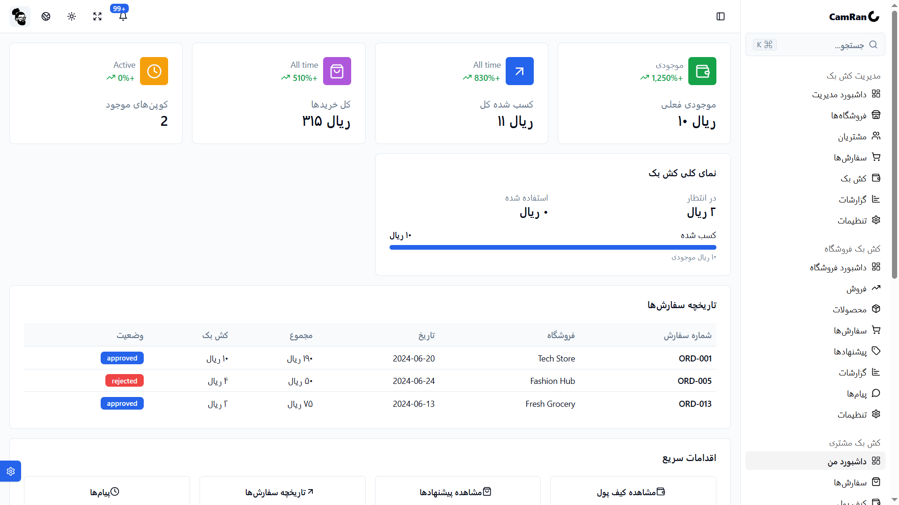
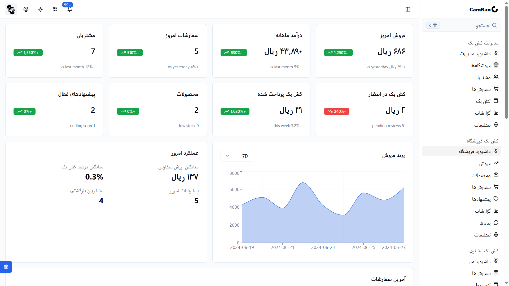
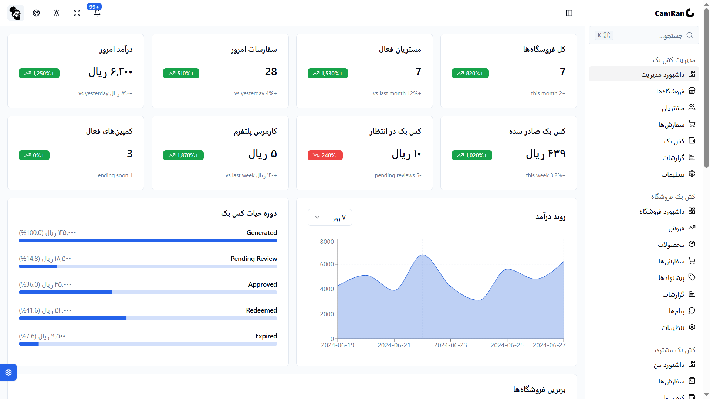
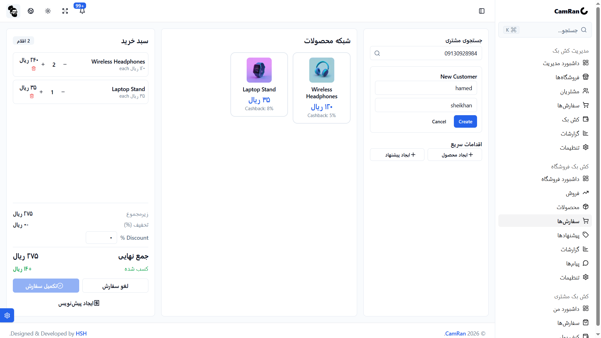
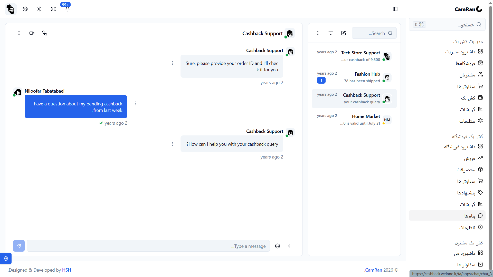

# Cashback Platform Demo

A modern **multi-vendor cashback and customer loyalty platform** built with **Next.js**, **React**, **TypeScript**, **Tailwind CSS**, and **shadcn/ui**.

This project demonstrates the concept of a shared cashback ecosystem where customers earn cashback from purchases and redeem their rewards across multiple participating merchants. It was developed as part of an **Electronic Commerce** university project to showcase the business model, user experience, and architecture of a cross-store loyalty platform.

> **Note**
>
> This repository is an educational **MVP (Minimum Viable Product)** and UI demonstration. It showcases the core business logic and user experience of the platform and is not intended to be used as a production-ready financial application.

---

# Screenshots


## Dashboards

| Customer Dashboard | Merchant Dashboard |
| :----------------: | :----------------: |
|  |  |

| Administrator Dashboard | POS Dashboard |
| :---------------------: | :-----------: |
|  |  |

| Support Chat |
| :----------: |
|  |

---

# Features

- 🎁 Multi-vendor cashback ecosystem
- 🤝 Shared customer loyalty network
- 👤 Customer dashboard
- 🏪 Merchant dashboard
- 💳 Cashback wallet demonstration
- 🛒 Simulated checkout & cashback flow
- 🖥 POS interface
- 🛠 Administrator dashboard
- 💬 Customer support chat
- 📈 Cashback campaigns
- 📚 Integrated business documentation
- 🌍 Multi-language routing
- 🇮🇷 Full RTL (Persian) support
- 📱 Responsive design
- 🎨 Modern UI built with shadcn/ui

---

# Technology Stack

- Next.js (App Router)
- React
- TypeScript
- Tailwind CSS
- shadcn/ui
- Lucide React
- React Hook Form
- Zod

---

# Project Structure

```text
app/
├── dashboard/              # User dashboards
├── demo/                   # Interactive product demo
├── documents/              # Business documentation
├── landing/                # Landing page
├── api/                    # API routes
└── ...

components/
├── ui/                     # shadcn/ui components
└── ...

public/
└── images/
    └── dashbords/
```

---

# Getting Started

## Clone the repository

```bash
git clone <repository-url>
cd <project-folder>
```

## Install dependencies

Using pnpm:

```bash
pnpm install
```

or npm:

```bash
npm install
```

## Run the development server

```bash
pnpm dev
```

or

```bash
npm run dev
```

Open your browser and navigate to:

```
http://localhost:3000
```

---

# Business Concept

The platform introduces a **shared cashback network** where multiple independent merchants participate in a common loyalty ecosystem.

Instead of offering isolated discounts, merchants reward customers with cashback that can be redeemed across any participating store.

This approach provides value for both sides:

### Customers

- Earn cashback after purchases
- Spend cashback across different merchants
- Centralized digital wallet
- Increased purchasing power
- Better shopping experience

### Merchants

- Higher customer retention
- Cross-store customer acquisition
- Reduced dependence on large marketplaces
- Campaign management
- Customer analytics
- Shared loyalty ecosystem

---

# Project Scope

The current implementation focuses on demonstrating:

- Cashback workflow
- Customer loyalty concept
- Merchant participation
- Wallet visualization
- User dashboards
- Platform navigation
- Business documentation
- Modern user experience

The following features are intentionally outside the scope of this demonstration:

- Payment gateway integration
- Banking settlement
- KYC verification
- Accounting
- Tax management
- Fraud detection
- Production security
- Real financial transactions

---

# Future Roadmap

Potential future improvements include:

- Merchant onboarding
- Customer authentication
- Real payment gateway integration
- Digital wallet implementation
- Automated cashback settlement
- Accounting module
- Campaign automation
- Analytics dashboard
- Fraud detection
- Push notifications
- Mobile application
- QR Code payments
- AI-powered recommendation engine

---

# Academic Purpose

This project was developed for an **Electronic Commerce** course to demonstrate:

- Business Model Design
- Customer Loyalty Systems
- Electronic Commerce Concepts
- Value Chain Analysis
- Marketing Strategy
- Multi-sided Platform Design
- Modern Frontend Development

---

# License

This project is intended for **educational and demonstration purposes**.

Commercial use or production deployment is not recommended without significant additional development, security auditing, and financial compliance.